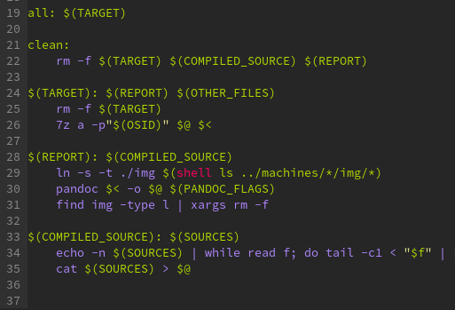

# 192.168.X.A - Description

This is the exploit walkthrough for my report

## Images

They should all reference the "img" directory, and must be unique
across all machine reports, since they are combined at the end.

